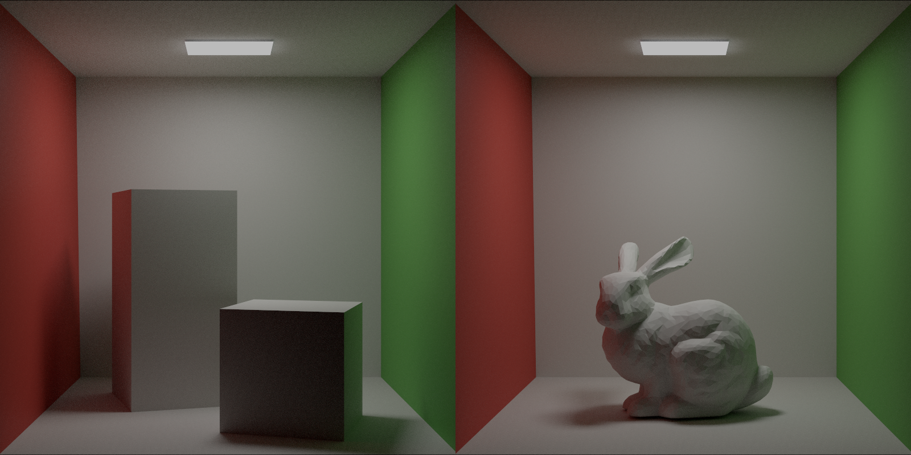
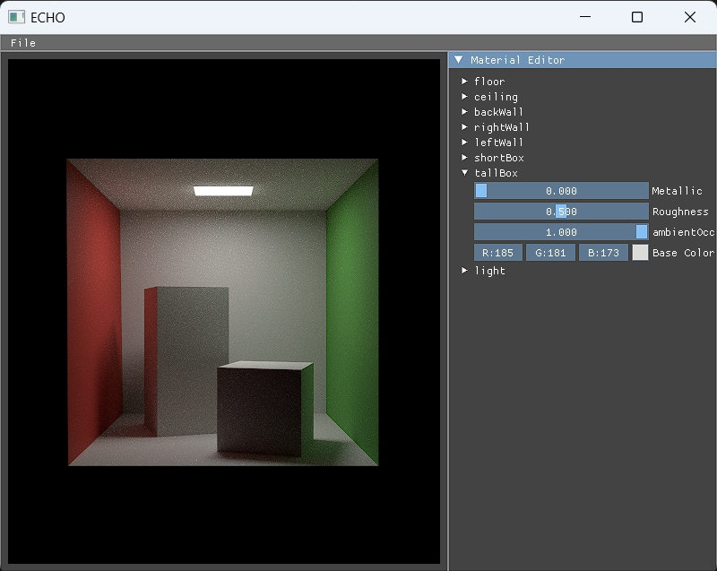
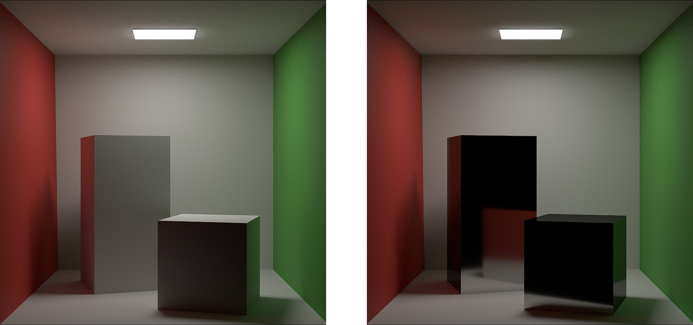
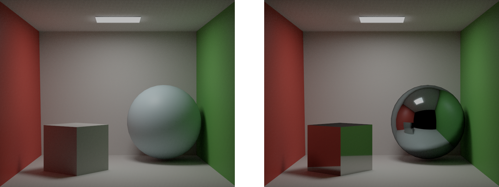
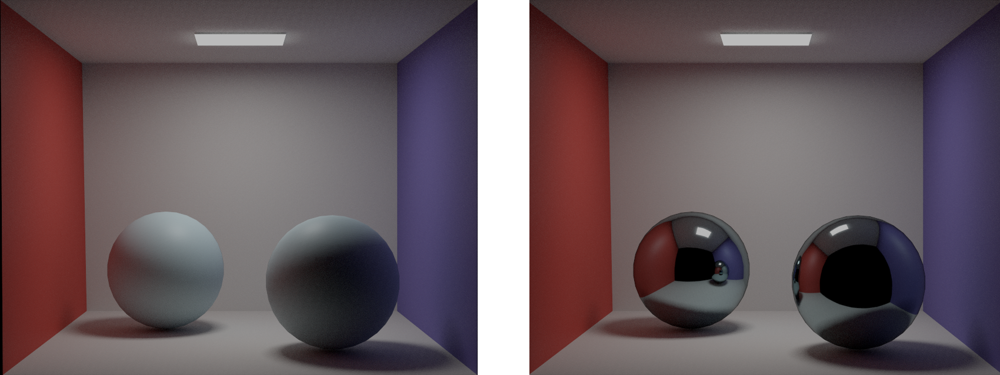
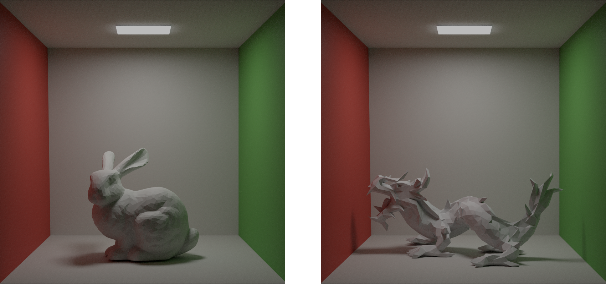
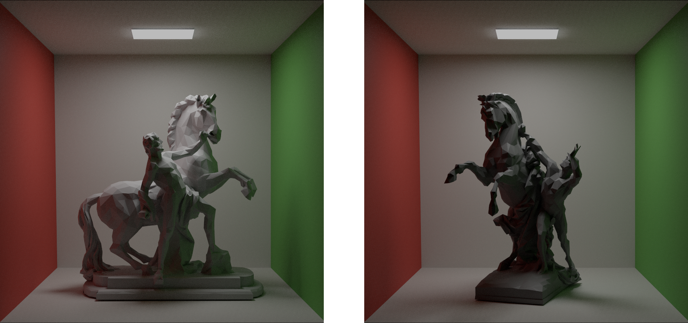

# ECHO : 基于Vulkan实现的路径追踪渲染器
---

- [概述](#概述)
- [主要特性](#主要特性)
- [效果展示](#效果展示)
- [项目结构](#项目结构)
- [编译与运行](#编译与运行)
- [致谢与参考](#致谢与参考)

## 概述

ECHO 是一个使用 **c++** 编写基于**Vulkan**实现的的**路径追踪渲染器**，ECHO 包含了一套完整的光栅化渲染管线以及一套实时的路径追踪管线，以及一套离线的路径追踪管线。

ECHO 提供基础UI支持**动态调整材质属性**，包括 albedo，metallic，roughness。ECHO 同时支持**切换场景**。
ECHO 还支持基础的**视角移动**，包括前进 (w) 后退 (s) 向左 (a) 向右 (d) 上升 (space) 下降 (ctrl) ，以及基于鼠标的视角转动。

ECHO 的光栅化管线实现了基于微表面理论的 Cook-Torrance 反射模型，也支持基础的 lambertian 和 Blinn-Phong 光照模型。以及基础的shadow map。
ECHO 的光栅化管线还实现了**天空盒（skybox）** 以及**基于图像的光照（Image Based Lighting）**。

ECHO 的路径追踪管线实现了**基于物理的材质模型**，Cook-Torrance 反射模型。使用**BVH 空间加速结构**加快射线与三角形的相交检测。路径追踪管线还实现了**帧间累计（temporal accumulation）**，图像会随着帧数逐渐稳定收敛。
ECHO 同时支持**实时路径追踪** （spp = 1） 与**离线高质量路径追踪** (spp > 1)。




## 主要特性

- 基于物理的材质（Cook - Torrance模型）
- 多重重要性采样，包含对光源的直接采样
- 基于时空信息的联合双边滤波
- 支持经典 Cornell Box 等标准测试场景

## 效果展示

如下为 ECHO 渲染的 Cornell Box 经典测试场景：

左侧为metallic = 0，roughness = 0.5; 右侧为metallic = 1，roughness = 0.05


CornellBox-Original:



CornellBox-Glossy:



CornellBox-Sphere:



---

如下是 ECHO 渲染的 Cornell Box 复杂测试场景：

拥有更多的顶点数以及面数。拥有还不错的软阴影与环境光效果。

Stanford Bunny and Dragon:



rossbaendiger_c:



---

如下是ECHO的UI功能，调整材质属性，重载模型，视角移动时，都会重置帧间累计。

帧间累计（temporal accumulation）：

https://github.com/user-attachments/assets/4630bd95-9e5a-429d-90e3-5d8bd2b1b1c9

材质属性调整：

https://github.com/user-attachments/assets/8a92a7e5-a40d-4b80-a157-aa7bad6a1416

重载模型：

https://github.com/user-attachments/assets/9fed986d-9f28-470b-9dc5-21202ed2eefa

视角移动：

https://github.com/user-attachments/assets/98da6238-b149-43f0-b9a5-772d85251997


## 项目结构

项目主要目录结构如下：

+ `src/`：c++代码
+ `shader/`：glsl代码
+ `models/`：模型资源（如 Cornell Box）
+ `texture/`：纹理资源（主要是环境贴图）
+ `extern/`：项目依赖的外部库（glfw, glm, imgui, stb_image）

## 编译与运行

ECHO 基于 CMake 构建，依赖 C++20 及以上标准，需预先安装好 CMake 和 Vulkan 环境。

[CMake ≥ 4.0.1](https://cmake.org/download/)

[Vulkan SDK ≥ 1.3.290](https://vulkan.lunarg.com/sdk/home)

一个支持 C++20 的编译器（如 MSVC、Clang、GCC）

1. 克隆代码仓库：

   ```bash
   git clone --recursive https://github.com/Anpan-z/echo.git
   cd echo
   ```

2. 构建项目：

   ```bash
   mkdir build
   cd build
   cmake ..
   cmake --build . --config Release
   ```

3. 运行渲染器：

   ```bash
   .\bin\Release\ECHO.exe
   ```

## 致谢与参考

- [1]. [GAMES101：现代计算机图形学入门](https://sites.cs.ucsb.edu/~lingqi/teaching/games101.html)
- [2]. [GAMES202: 高质量实时渲染](https://sites.cs.ucsb.edu/~lingqi/teaching/games202.html)
- [3]. [Ray Tracing in One Weekend](https://raytracing.github.io/)
- [4]. [Hammersley Points on the Hemisphere](http://holger.dammertz.org/stuff/notes_HammersleyOnHemisphere.html)
